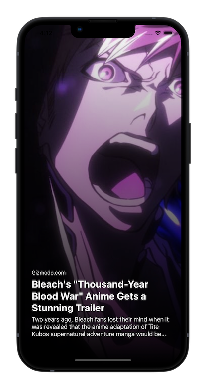

    <h1>Newsi</h1>
    <i>A simple news app with a TikTok like interface</i>

 

    Information
     
    
    

---

## Key Features
- Vanilla SwiftUI + Combine + MVVM
- No external dependencies

## Screenshot

## Getting Started

### Prerequisites
1. Xcode

### Installation
1. Clone or download the project to your local machine
2. Run the simulator

## To-Do
- [ ] Implement image cache since AsyncImage doesn't have one (sadly!)
- [ ] Implement test cases
- [ ] More dependency injection coverage

## Licence
Newsi is released under the MIT license. See [LICENSE](./LICENSE) for details.
